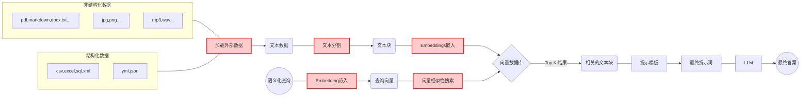

## 实现一个领域知识问答机器人
当前自有数据接入大模型有两种方式：微调模型和在 Prompt 上下文中带入知识

- prompt 上下文中带入知识，例如[AI法律助手](https://github.com/lvwzhen/law-cn-ai)
  - 缺点：效果较差，难以在要求比较高的垂直场景使用
  - 优点：即开即用，应用落地速度非常快
- 微调（Fine-tuning）注入专业领域知识，例如[中文法律通用模型](https://github.com/LiuHC0428/LAW-GPT)由ChatGLM-6B LoRA 16-bit指令微调得到
  - 缺点：减少了LLM编排的逻辑，直接调用即可
  - 优点：成本和时间花费都比较高，而且需要定期进行调整以保持更新（法律文本还好一些）

下面是一个领域问答机器人（Prompt 上下文中带入知识）的实现通用流程图

### 保险合同解读机器人
在[人身保险产品信息库](https://www.iachina.cn/art/2017/6/29/art_71_45682.html) 查询已备案的保险合同原件，为PDF格式

#### 合同文档分割
最简单的方案自然是，把保险条款按页码一页一页分块，如果一页内容也超了，那我们就半页半页分块。 但这忽略了一个最大的问题，知识内容并非是按页码分割的 。一个知识可能第三页正好起了个标题，第四页才是详细的描述。
### 其他
#### 大语言模型
  -  [ChatGLM-6B 是一个开源的、支持中英双语的对话语言模型](https://github.com/THUDM/ChatGLM-6B)
  -  通过 [FastChat](https://github.com/lm-sys/FastChat) API 调用 LLM 模型

#### 支持文本嵌入的模型
  -  [nghuyong/ernie-3.0-nano-zh](https://huggingface.co/nghuyong/ernie-3.0-nano-zh)
  -  [shibing624/text2vec-base-chinese](https://huggingface.co/shibing624/text2vec-base-chinese)
  -  [GanymedeNil/text2vec-large-chinese](https://huggingface.co/GanymedeNil/text2vec-large-chinese)
  -  [moka-ai/m3e-base](https://huggingface.co/moka-ai/m3e-base)
  -  [用于句子、文本和图像嵌入的Python库](https://github.com/UKPLab/sentence-transformers)

### 参考链接
1. [构建基于大型语言模型的 AI 应用](https://medium.com/mlearning-ai/building-large-language-model-powered-ai-applications-96780d67c64a)
2. [LangChain AI 手册](https://www.pinecone.io/learn/langchain-intro/)