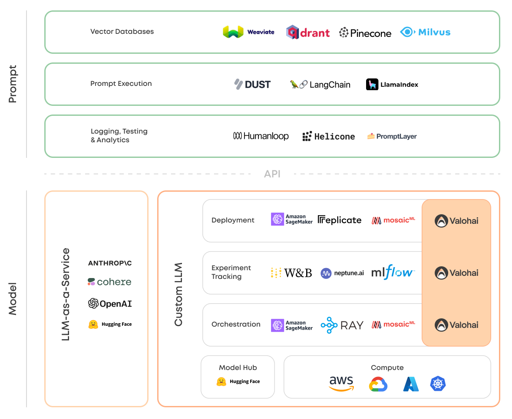

本电子书开源，欢迎 star 🌟，关注《LLM 应用开发实践笔记》

> **交流群** 创建了一个LLM应用开发交流群，有需要的可以选择加入

## Prompt 提示层

提示管理层与模型服务层通过 API 相关联，主要包括向量数据库，提示词编排工具，提示词的日志监控，测试及分析。

### Vector Database 向量数据库

- [Pinecone](https://www.pinecone.io/blog/)
- [Milvus](https://milvus.io/blog)
- [Weaviate](https://weaviate.io/blog)
- [Qdrant](https://blog.qdrant.tech/)
- [chroma](https://www.trychroma.com/blog)

### Prompt Flow 提示词编排

- [LangChain](https://blog.langchain.dev/)

### Logging，Testing & Analytics 日志监控，测试及分析

- [Humanloop](https://humanloop.com/blog)：帮助开发者在大型语言模型（如GPT-3）之上构建高性能应用程序。您可以使用它来尝试新的提示，收集模型生成的数据和用户反馈，并对模型进行微调以提高性能并优化成本。

- [Helicone](https://www.helicone.ai/blog)：一个开源的可观测性平台，用于记录所有请求到OpenAI的日志，并提供用户友好的UI界面、缓存、自定义速率限制和重试等功能。它可以通过用户和自定义属性跟踪成本和延迟，并为每个日志提供一个游乐场，以在UI中迭代提示和聊天对话。此外，Helicone还提供了Python和Node.JS支持，以及开发者文档和社区支持。

- [PromptLayer](https://promptlayer.com/)：记录 OpenAI 请求，搜索使用历史记录，跟踪表现，直观地管理提示模板。做的比较简单。

- [Vellum.ai](https://www.vellum.ai/blog)：致将LLM强大特性与用于提示工程、语义搜索、版本控制、定量测试和性能监控的工具结合，使其投入生产。与所有主要的LLM提供商兼容。

- [Rebuff AI](https://rebuff.ai/)：旨在通过多层防御，保护 AI 应用免受即时注入攻击 —— 第一个系统地用 AI 做注入攻击防御的项目。

- [Portkey](https://portkey.ai/)：模型管理和可观测性：管理模型（提示、参数、引擎、版本），查看模型和版本之间的流量和延迟，无需停机，无缝升级。实时查看和调试请求，跟踪用户之间的流量和使用情况，当AI提供商出现故障时，获取状态更新，通过缓存和边缘计算来降低延迟。
