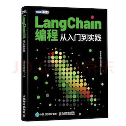

> 欢迎 star🌟 ，持续关注《LLM 应用开发实践笔记》

我的新书[《LangChain编程从入门到实践》](https://u.jd.com/V8pkqFY) 已经开售！推荐正在学习AI应用开发的朋友购买阅读！

[](https://u.jd.com/V8pkqFY)

‼️‼️重要更新
1. 新增**LLM 应用评估与测试**、**RAG专题**、**国内模型厂商API解读** 3个章节
2. **开放交流群** 最近有很多朋友，从网站专门过来加我微信，询问是否可以创建一个LLM应用开发交流群，现在已开放，有需要的朋友可以选择加入


## 本地阅读
### 构建gitbook镜像(可选)
下载本仓库后，执行`docker build . -t <image:tag>`构建自定义镜像，也可以直接使用我构建好的镜像`morso1/gitbook-server:3.2.3`

### 启动gitbook服务
```bash
cd llm-book

docker run --rm -v "$PWD/LLMProjects:/gitbook" -p 4000:4000 morso1/gitbook-server:3.2.3 gitbook serve
```
本地打开4000端口开始阅读

## 目录大纲

* [前言](README.html)
* 大语言模型概述
    * [大语言模型概况](https://aitutor.liduos.com/01-llm/01-1.html)
    * [你好, ChatGPT](https://aitutor.liduos.com/01-llm/01-2.html)
    * [OpenAI 文档解读](https://aitutor.liduos.com/01-llm/01-3.html)
    * [动手实现聊天机器人](https://aitutor.liduos.com/01-llm/01-4.html)
    * [基于 OpenAI API 搭建一个端到端问答系统](https://aitutor.liduos.com/01-llm/01-5.html)
    * [LLM 安全专题](https://aitutor.liduos.com/01-llm/01-6.html)
* LangChain入门
    * [LangChain介绍](https://aitutor.liduos.com/02-langchain/02-1.html)
	* [LangChain模块学习](https://aitutor.liduos.com/02-langchain/02-2.html)
    * [LangChain之Chains模块](https://aitutor.liduos.com/02-langchain/02-2-1.html)
    * [LangChain之Agents模块](https://aitutor.liduos.com/02-langchain/02-2-2.html)
    * [LangChain之Callback模块](https://aitutor.liduos.com/02-langchain/02-2-3.html)
    * [Embedding嵌入](https://aitutor.liduos.com/02-langchain/02-3.html)
    * [动手实现文档问答机器人](https://aitutor.liduos.com/02-langchain/02-4.html)
* LlamaIndex 概述
    * [LlamaIndex介绍](https://aitutor.liduos.com/03-llamaIndex/03-1.html)
    * [LlamaIndex索引](https://aitutor.liduos.com/03-llamaIndex/03-2.html)
    * [动手实现企业知识库](https://aitutor.liduos.com/03-llamaIndex/03-3.html)
* HuggingGPT 实现
    * [HuggingFace 介绍](https://aitutor.liduos.com/04-huggingface/04-1.html)
    * [transformers 库基础组件](https://aitutor.liduos.com/04-huggingface/04-2.html)
    * [多模态任务设计](https://aitutor.liduos.com/04-huggingface/04-3.html)
    * [动手实现 HuggingGPT](https://aitutor.liduos.com/04-huggingface/04-4.html)
* LLMOps 专题
    * [LLMOps 介绍](https://aitutor.liduos.com/06-llmops/06-1.html)
    * [Model 模型层](https://aitutor.liduos.com/06-llmops/06-2.html)
    * [Prompt 提示层](https://aitutor.liduos.com/06-llmops/06-3.html)
    * [狭义LLMOps](https://aitutor.liduos.com/06-llmops/06-4.html)
* Agent 专题
    * [Agent 介绍](https://aitutor.liduos.com/07-agents/07-1.html)
    * [Agent 项目跟踪](https://aitutor.liduos.com/07-agents/07-2.html)
    * [Multi-Agent 框架](https://aitutor.liduos.com/07-agents/07-3.html)
* RAG专题
    * [数据索引环节](https://aitutor.liduos.com/08-rag/08-1.html)
    * [检索环节](https://aitutor.liduos.com/08-rag/08-2.html)
    * [生成环节](https://aitutor.liduos.com/08-rag/08-3.html)
* LLM 应用评估与测试
    * [如何评估一个大语言模型](https://aitutor.liduos.com/09-llm-evelation-test/09-1.html)
    * [基于大模型的Agent进行测试评估](https://aitutor.liduos.com/09-llm-evelation-test/09-2.html)
    * [RAG系统效果评估](https://aitutor.liduos.com/09-llm-evelation-test/09-3.html)
* 国内模型厂商API解读
    * [六家大模型能力比较](https://aitutor.liduos.com/10-china-llm/10-01.html)
    * [MiniMax大模型开发](https://aitutor.liduos.com/10-china-llm/10-02.html)
    * [智谱AI大模型开发](https://aitutor.liduos.com/10-china-llm/10-03.html)
    * [MoonShot大模型开发](https://aitutor.liduos.com/10-china-llm/10-04.html)
- 基于大型语言模型的生成式AI
  * [课程介绍](https://aitutor.liduos.com/05-generative-ai-with-llms/05-1.html)

* 参考资料
    * [A16Z推荐的AI学习清单](https://aitutor.liduos.com/ref/a16z.html)
    * [Prompt专题](https://aitutor.liduos.com/ref/prompt.html)
    * [一些课程资料汇总](https://aitutor.liduos.com/ref/ref.html)
