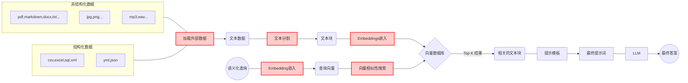

### 知识问答机器人实现通用流程图

```mermaid
graph LR
subgraph 结构化数据
    A1[csv,excel,sql,xml]
    A2[yml,json]
end
subgraph 非结构化数据
    B1[pdf,markdown,docx,txt...]
    B2[jpg,png...]
    B3[mp3,wav...]
end

非结构化数据 --- 加载外部数据
结构化数据 --- 加载外部数据
A(文本数据)
加载外部数据 --> A
style 加载外部数据 fill:#ffcccc, stroke:#ff0000, stroke-width:2px;
A --- 文本分割 --> B(文本块)
style 文本分割 fill:#ffcccc, stroke:#ff0000, stroke-width:2px;
B --- Embeddings嵌入 ---> E{向量数据库}
style Embeddings嵌入 fill:#ffcccc, stroke:#ff0000, stroke-width:2px;

C((语义化查询)) --- Embedding嵌入 --> C1(查询向量)
style Embedding嵌入 fill:#ffcccc, stroke:#ff0000, stroke-width:2px;

C1 --- 向量相似性搜索 --->E 
style 向量相似性搜索 fill:#ffcccc, stroke:#ff0000, stroke-width:2px;

E -- Top K 结果 ---> D(相关的文本块)---提示模板-->最终提示词--- LLM -->F((最终答案))
```