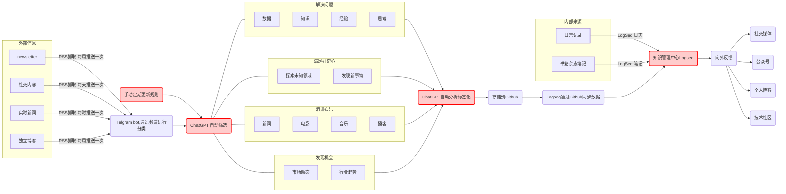

### 信息处理流水线
1. 人每天的认知资源和意志力是有限的，都是消耗品。
2. 被动等着时间线上把社会新闻喂到嘴里，我对于世界在发生什么是毫无感知的，或者说，没有建立起来自己的主动信息源系统。
3. 不定期地审视核心信息源，保持质量，防止信息茧房

![](https://mermaid.ink/img/pako:eNqdVd1u2lgQfhXLe0MkIq2B9oKVVkpCoa1aadXkau1eOMEUtMSkYNRWVSVIGvJHAmna0CWkLDS0lA2EKG1KSFNexnNsv0XHHNtJml7s9lx5vpn5Zs7MnPFTdiYRllg_-yApzkWZO_cEOZWepgLsbRsLTXVQI9kDQWbwjHG8LD1KxSVFkZL3LczDa3tf1f4e5Bahc2KjXh46b0jpmGx3jdKpjfp4bW1f-3cN1svQqSMqyWFBFuQxjhkdZe5NTpLVLShsu8lBATabZKNpZLJqL0P2a6j_nRl3TUlxTG6WmU4obiNT1gdLRn3TyG7pgx29loflnHZ4OoJ8nqt8ex-u8qGl94qlmfWPLH3_LUfzPk4N9fdvIXdklDpG_TWtQYgnr7pkvWOV5CavVRv6Qc4Sb_HaacFo5S3xNk8yu3pm4bxSDjM5renHR9A4g8YSDBYscg_Hk4269rFOKi0kNuo5qFbv20oPD4VNbaOLTVH7a9rKhx_xHi8b2bfQPFRPipafF0kvtjHkxZ6__ARnhw7g5Y3qEXo4gI8nL9qXenw-VzSHSl_9UrbMfRwPvXmo9GG1STJZm8Xn4bGraq-sH6_B6uCca5xzkRWEmtApk0qV7HzEBPX3z2H575FhFyZcE1FRCf0xZU4Koy-1TOJ_lrT2V5yOlPIkLjHjHBOJxeP-XyKRGTxuJqUkE39JpvwrHlsefRQLK1G_Z-7xbxj3O3JKrLV3jMyKQzzx_3knkHf00rAMAwXsQDQOjjd5U6TXgPy2EzDwswG_myEa01FeGITLmosNNDWBy-3NLeLaILsN0rcGaOwaT0oN6PX0ThfOXtnL4DqvnrzTDtfJ7jwMStr-S1TbLR67Zj62O4kHk9JDxnQelIY5BDnUXb-go262SpADNFXOBe3XMI8l64ZiSjQ9jcUKcEPdDRe6pqSHdH1QLRTzpN2gDxMtb1ixXPRtap2aVsypvTbWiPo6pQ_-xBAFaR5BFxQ3ccdCYd14t4yMwSEcwqh0n7ZeqGdbDn4Tr7S4r34pQeGzA97iXGqvpfb7dKE6-G18H6sZUjlAKsj3R1g3OyslZ8VYGFf9U7P-AqtEpVlJYP34GZYiYjquCKwgP0NTMa0kJp_IM6w_IsZTkptNz4VFRQrERHP3OqgUjimJ5F36_xj-RtzsnCj_mUjYNs--ATvn3vY?type=png)

### 个人信息处理系统的理论来源

#### GTD（Get Things Done）理论
> 该理论提供了一套简单的、可操作的个人任务管理方法，帮助人们有效地组织和处理各种任务和信息。
- 将所有任务和信息收集到一个地方，避免遗漏和混乱。
- 对每一个任务进行分析和处理，确定下一步行动和优先级。
- 将任务和信息进行组织和存储，方便后续查找和使用。
- 定期回顾和反思自己的任务和信息处理系统，找出问题和改进方式。
- 不断优化和改进个人任务管理系统，提高效率和效果。

#### 信息加工模型
> 该模型提供了一个理论框架，用于理解人类如何处理和记忆信息。该模型包括感知、编码、存储、检索和遗忘等过程，可以帮助人们更好地处理和管理个人信息。
- 感知：注意力和感知是信息加工的第一步，需要关注和筛选有用的信息。
- 编码：将信息进行编码和处理，转化为可以存储和检索的形式。
- 存储：将编码后的信息存储在记忆系统中，包括短期记忆和长期记忆。
- 检索：从存储的信息中检索出需要的信息，需要利用记忆系统中的索引和联想。
- 遗忘：根据需要清理和遗忘不再需要的信息，以保持信息系统的清晰和高效。

#### 大脑记忆模型
> 该模型基于大脑如何记忆信息的理论，提供了一些实用的方法，例如使用记忆宫殿法、分组和联想等技巧来提高记忆和信息处理能力。
- 记忆宫殿法：通过将需要记忆的信息与地理空间相结合，利用空间记忆来增强信息记忆。
- 分组：将信息按照一定的规律进行分组和分类，可以提高信息存储和检索的效率。
- 联想：通过与已经记忆的信息进行联想，可以更好地记忆和使用新的信息。

#### 时间管理理论
> 该理论提供了一些方法和技巧，帮助人们更好地管理时间，避免浪费时间，提高工作效率。
- 时间回顾：对过去一段时间的时间使用情况进行回顾和分析，找出时间浪费的原因和改进方法。
- 任务优先级：确定任务的优先级，将时间和精力集中在最重要和紧急的任务上。
- 时间块：将时间分割成块，集中精力完成一项任务，提高效率和专注度。
- 时间规划：合理规划时间，避免时间浪费和拖延。

### 一些实践框架【补充】

#### [混乱的信息流与策展式阅读](https://xiaoxinhao.zeabur.app/article/read-information)
> 收获：梳理你的全部信息输入渠道，按照 **感兴趣的**、**想探索的**、**想提升的** 进行分类组织，以此构建自己的信息池，随着自己的认知能力提高和关注点变化，可以对信息池进行迭代更新，构建一个动态的”信息茧房“。

> 缺陷：提到信息的黑暗森林概念以及应对方式，但只是一些正确的废话，说的都对但没有提供一些实际可操作的方法和技巧来应对信息的不确定性和复杂性。

#### [信息流转学](https://gofurther.feishu.cn/docx/OqQ2dgVUzoZeB3xuXM0cZjnbnqc)
> 收获：围绕信息流转三环节`输入、处理和输出`提供了一些可操作实践的方法论。站在编程的角度最易理解，方法论就是`数据结构+算法`中的算法，并通过[知识贴身度](https://gofurther.feishu.cn/docs/doccnbZAjYhNeH6q0MZVasdrXLb#y93J7e)和[领域掌握度](https://gofurther.feishu.cn/docs/doccnbZAjYhNeH6q0MZVasdrXLb#Qz3RJ4)的指标来量化信息理解程度。

### 改善思维的工具
> 一系列思维工具和框架，帮助解决问题，做出决策和理解系统，可以按照四个方面进行不严格分类，适用方向有交叉，部分工具在日常工作学习会使用到，但是没有体系的了解过。
> [设计师的心智模型](https://dropbox.design/article/mental-models-for-designers)

#### [系统化思维](./04-1.md)
#### [决策过程](./04-2.md)
#### [解决问题](./04-3.md)
#### [沟通](./04-4.md)